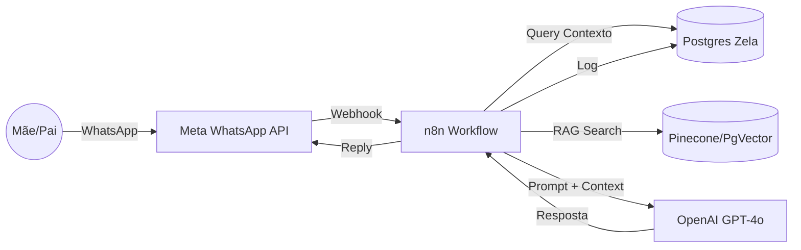

# 🩺 Arquitetura Técnica: Zela Pediatra (IA + WhatsApp)

Este documento detalha a implementação da "Dra. Zela", assistente virtual pediátrica integrada ao ecossistema Zela.

## 🏗 Visão Geral da Arquitetura

A solução utiliza uma arquitetura orientada a eventos (Event-Driven) orquestrada pelo n8n, garantindo baixo acoplamento e alta escalabilidade.

---

## 🛠 Componentes Chave

### 1. Orquestrador (n8n)
O workflow JSON fornecido (`n8n_zela_pediatra_workflow.json`) implementa o seguinte fluxo:
1.  **Webhook Trigger:** Recebe o payload JSON da API do WhatsApp Business.
2.  **User Identification:** Extrai o `from` (número de telefone) e consulta a tabela `users` do Zela para identificar quem está falando e qual o bebê associado.
3.  **LLM Processing:** Envia a dúvida do usuário + dados do bebê (Idade, Nome) para o GPT-4o.
4.  **Response:** Envia a resposta de volta via API do WhatsApp.
5.  **Audit Logging:** Salva a conversa na tabela `chat_logs` para auditoria e segurança.

### 2. Banco de Dados (Postgres)
Novas tabelas criadas na migração `migration_expansion.sql`:
*   `chat_logs`: Armazena histórico, sentimento e tópicos.
*   `milestones`: Permite que a IA saiba se o bebê está atrasado em algum desenvolvimento.

### 3. Inteligência Artificial (Safety First)
Para garantir segurança médica, o System Prompt inclui **Guardrails Rígidos**:
*   🚫 **Proibido:** Diagnosticar doenças graves, prescrever antibióticos.
*   ✅ **Obrigatório:** Citar fontes (SBP/AAP), recomendar PS em caso de febre alta/falta de ar.

---

## 🚀 Como Implementar

### Pré-requisitos
1.  Conta **Meta for Developers** (WhatsApp Business API configurado).
2.  Instância **n8n** (Cloud ou Self-Hosted via Docker).
3.  Chave de API **OpenAI**.

### Passo a Passo
1.  **Importar Workflow:** No n8n, vá em "Workflows" > "Import from File" e selecione `n8n_zela_pediatra_workflow.json`.
2.  **Configurar Credenciais:**
    *   Conecte seu Postgres de produção.
    *   Adicione sua OpenAI API Key.
    *   Adicione o Token do WhatsApp (Meta).
3.  **Configurar Webhook:** Copie a URL do Webhook do n8n e configure no painel do Meta Developers.
4.  **Testar:** Envie uma mensagem "Meu bebê está com febre de 38 graus, o que faço?" para o número de teste.

## 🔒 Privacidade e LGPD
*   Os dados de saúde são sensíveis. O banco de dados deve ter criptografia em repouso (TDE).
*   O histórico de chat é retido apenas pelo tempo necessário ou até o usuário solicitar exclusão ("Direito ao Esquecimento").
